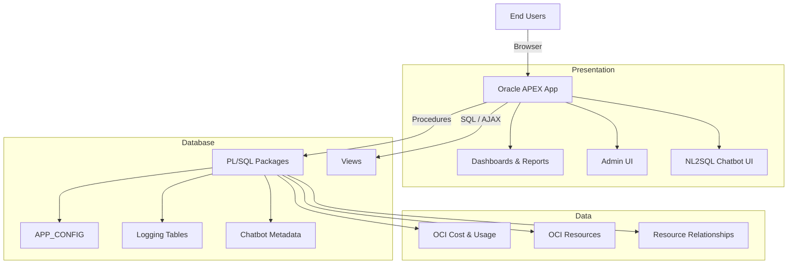

# Architecture

Home: [README](../README.md) · **Docs** · **Architecture**

This document explains how the application is structured and why it is built “database-first”.

---

## At a glance
The system is intentionally split into three layers:

1. **Presentation**: Oracle APEX (dashboards, reports, admin UI, chatbot UI)
2. **Logic**: PL/SQL packages (analytics, ingestion, chatbot orchestration, deployment manager)
3. **Data**: cost/usage datasets, OCI metadata, relationships, configuration, and logs

Key design goals:
- **portable** across environments (DEV/TEST/PROD, different tenancies)
- **configuration-driven** (minimal hardcoding)
- **auditable** (every meaningful action is logged)
- **safe by design** (guardrails for both analytics and chatbot execution)

---

## High-level architecture diagram

---

## What runs where

### Oracle APEX (presentation)
- Renders dashboards and interactive reports
- Provides admin screens for configuration and operations
- Hosts the chatbot UI (question input, results, “why this SQL” explanation)

### PL/SQL packages (logic)
- Implement data refresh orchestration and analytics transforms
- Provide stable APIs for the UI and scheduled jobs
- Implement the NL2SQL pipeline (metadata lookup → safe SQL generation → execution → logging)
- Implement deployment/upgrade via `DEPLOY_MGR_PKG`

### Data layer
- Cost/usage tables and timeseries aggregates
- OCI inventory and relationships (where available)
- Runtime configuration (`APP_CONFIG`) and reference metadata (glossary / chatbot rules)
- Operational logs (job runs, deployment runs, chatbot logs)

---

## Request flows

### Dashboards / reports
1. User interacts with APEX report or chart.
2. APEX queries curated views and/or calls PL/SQL procedures.
3. Data is returned from time-series aggregates and metadata-enriched tables.
4. Queries are designed to be repeatable and explainable (no hidden transformations in the UI).

### Chatbot
1. User asks a question.
2. The pipeline selects candidate tables and glossary hints from metadata.
3. The LLM produces constrained JSON (not raw SQL).
4. The system generates the final SQL deterministically and executes it safely.
5. Results and reasoning artifacts are logged for audit/troubleshooting.

See [NL2SQL Chatbot](chatbot.md) for details.

---

## Portability and environment separation
The same bundle is intended to deploy across environments. Portability relies on:
- environment values stored in `APP_CONFIG` (not in code)
- policy-based OCI access (Resource Principal, dynamic groups, IAM policies)
- consistent naming for jobs, logs, and core tables

---

## Where to go next
- [Infrastructure Requirements](infra-requirements.md)
- [Deployment](deployment.md)
- [Security & Trust Model](security.md)
