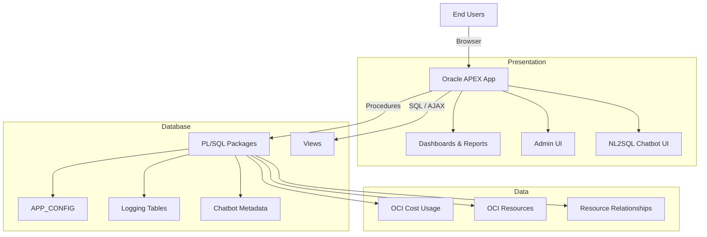
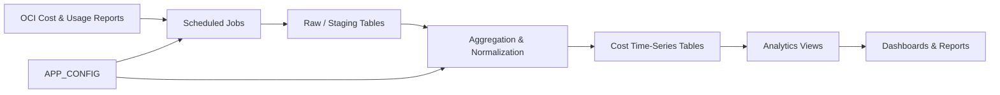

# Architecture

Home: [README](../README.md) · **Docs** · **Architecture**

## Overview
The application follows a **three-layer architecture**:

1. **Presentation Layer (Oracle APEX)**
2. **Application & Analytics Layer (PL/SQL)**
3. **Data & Integration Layer (OCI Cost & Resource Data)**

The design emphasizes:
- database-centric logic
- configuration-driven behavior
- environment portability
- traceability and logging

## Architecture Diagram

The following diagram shows the high-level system architecture and separation of concerns.

- Oracle APEX provides the presentation layer
- All business logic resides in the database
- Configuration and chatbot behavior are data-driven

---

## 1. Presentation Layer (Oracle APEX)

### Responsibilities
- Dashboards and charts for cost analytics
- Interactive reports and drilldowns
- Administration and configuration UI
- Chatbot user interface

### Characteristics
- No business logic embedded in pages
- SQL queries primarily reference views or packaged functions
- Centralized theming and shared components
- Logging and execution delegated to DB packages

### Key Page Groups
- Cost overview dashboards
- Resource and workload analytics
- Tag and filter-driven reports
- Chatbot page (NL input → results + explanation)
- Admin/configuration pages

---

## 2. Application & Analytics Layer (PL/SQL)

This layer contains the **core intelligence** of the system.

### Main Responsibilities
- Cost aggregation and normalization
- Resource-to-cost correlation
- Tag extraction and mapping
- NL2SQL chatbot pipeline
- Job orchestration and logging

### Major Package Categories
- **Cost ingestion & refresh**
  - Time-series refresh procedures
  - Monthly/daily aggregation
- **Analytics & reporting**
  - Pivoting, trend analysis, comparisons
- **Configuration & utilities**
  - APP_CONFIG accessors
  - JSON helpers, logging helpers
- **Chatbot (NL2SQL)**
  - Intent routing
  - Glossary-based SQL generation
  - Execution and summarization

All logic is implemented in PL/SQL and exposed to APEX via views and packaged APIs.

---

## 3. Data & Integration Layer

### Core Data Domains
- **Cost usage time series**
  - Daily and monthly OCI cost data
- **OCI resources**
  - Resource identifiers, regions, compartments
- **Relationships**
  - Parent–child resource mappings
- **Tags**
  - Defined and freeform tags
  - Normalized via configuration
- **Configuration**
  - Application behavior driven by data
- **Logging**
  - Job runs, chatbot requests, execution traces

### External Inputs
- OCI Cost & Usage reports
- OCI resource inventory
- OCI tags (non-uniform across tenancies)

---

## NL2SQL Chatbot Architecture (High Level)

1. User enters natural language question in APEX
2. Intent is inferred using glossary and rules
3. Relevant tables, metrics, and filters are selected
4. SQL is generated dynamically
5. SQL is executed safely
6. Results are summarized and returned
7. Full trace is logged for debugging and auditing

Details: [chatbot.md](chatbot.md)

---

## Design Principles
- **Database-first**: logic close to data
- **Config over code**: behavior driven by tables
- **Traceability**: everything logged
- **Environment portability**: no hardcoded OCIDs or secrets
- **Extensibility**: new datasets and chatbot rules without code changes

---

## Operational View
- Scheduled jobs refresh and aggregate data
- APEX pages remain read-only consumers
- Failures are diagnosable via run IDs and logs
- Deployment is repeatable via SQL + APEX import

---

## Cost Data Flow

This diagram illustrates how OCI cost data flows from ingestion to dashboards.

Key points:
- Data is refreshed via scheduled jobs
- Aggregations and normalization occur centrally
- Dashboards and chatbot read from the same facts

**See also**
- [Data Model](data-model.md)
- [Deployment Guide](deployment.md)
- [Security Model](security.md)
