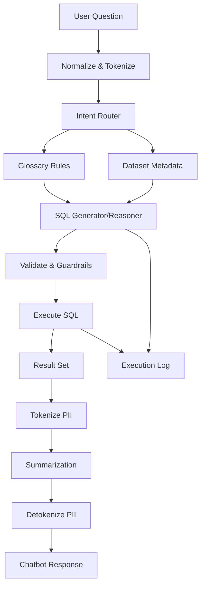
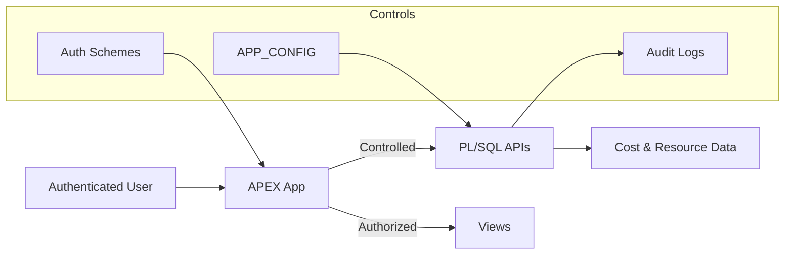

# NL2SQL Chatbot

Home: [README](../README.md) · **Docs** · **NL2SQL Chatbot**

## Purpose
The NL2SQL chatbot allows users to query OCI cost and resource data using **natural language**, without writing SQL.

Example questions:
- “Show total cost last month by service”
- “Which workloads increased cost this quarter?”
- “Cost per cluster including child resources”
- “Show monthly cost trend with MoM percentage change”

The chatbot is **metadata-driven**, explainable, and fully logged.

---

## Design Principles

- Deterministic SQL generation (not free-form LLM guessing)
- Business language mapped explicitly to schema
- No hardcoded table or column names
- Fully auditable execution
- Safe execution boundaries
- Declarative rule-based behavior via glossary metadata

---

## High-Level Flow

1. User submits a question via APEX  
2. Input is normalized and tokenized  
3. Intent and entities are inferred  
4. Glossary rules determine:
   - metrics
   - dimensions
   - filters
   - time ranges
   - comparison logic (MoM, WoW, trends)
5. SQL is generated  
6. SQL is validated and executed  
7. Results are summarized  
8. Full trace is logged  

---

## Chatbot Processing Pipeline



---

## Core Components

### 1. Glossary Rules (Primary Control Layer)

Glossary rules define how **business language maps to SQL semantics**.

They control:
- metrics
- filter dimensions
- grouping dimensions
- time logic
- period comparison semantics

Rules are stored in database tables and managed via APEX UI.

No application redeployment is required to extend vocabulary or behavior.

---

### Rule Types (by ROLE)

#### metric
Defines measurable values.

Examples:
- cost → COST
- usage → USAGE

---

#### filter_dimension
Defines WHERE clause behavior.

Examples:
- “storage” → SERVICECATEGORY LIKE '%STORAGE%'
- Workload1 → WORKLOAD_NAME LIKE '%WORKLOAD1%'

---

#### group_dimension
Defines GROUP BY behavior.

Examples:
- “by service”
- “per workload”
- “per region”

---

#### generic_time_filter

Used for:

- Fixed ranges  
  - “summer”
  - “December”

- Rolling windows  
  - “last 7 days”
  - “past 3 months”

- Period comparisons  
  - MoM
  - WoW
  - DoD
  - QoQ

These rules may:

- inject WHERE clauses
- define time bucketing
- enforce time-series output
- trigger window functions

---

## Time Logic Examples

### Fixed period mapping (Summer)

```json
{
  "applies_to": "EXPR_FILTER",
  "expr": "EXTRACT(MONTH FROM DATE_BUCKET)",
  "operator": "IN",
  "value": [6,7,8]
}
```

---

### Default daily snapshot behavior

If user omits a date:

```sql
DATE_BUCKET = TRUNC(SYSDATE-3,'DD')
```

Ensures consistent reporting snapshots.

---

## Period Comparison Logic

Example glossary rule:

```json
{
  "applies_to": "PERIOD_COMPARISON",
  "comparison": { "type": "MOM", "basis": "PCT_CHANGE" },
  "time_grain": "MONTH",
  "requires_time_series": true
}
```

This automatically triggers:

- compare intent
- monthly bucketing
- LAG window functions
- percentage change calculation

---

## SQL Generation

SQL is generated from the reasoning plan.

Characteristics:

- No dynamic guessing
- No hidden joins
- No silent filters
- No unsafe clauses

---

## APEX Rule Management UI

Rules are maintained using APEX admin pages.

Screenshot placeholders:

Glossary Rule Editor  


Create Glossary Rule 


Update Glossary Rule 


Create Glossary Keyword 


Create Workload Rule 


Keyword Tester


Examples


---

## Guardrails



---

## Summarization

Results are rendered as:

- tables
- charts
- natural language explanations

Summaries describe:

- filters
- time window
- applied comparison logic
- metric interpretation

---

## Logging & Traceability

Every request logs:

- user input
- glossary hits
- reasoning JSON
- generated SQL
- execution statistics

---

## Extending the Chatbot

To add new logic:

1. Add glossary rule
2. Add keywords
3. Adjust priority
4. Test in UI

No PL/SQL changes required.

---

## Failure Modes

Typical causes:

- missing glossary coverage
- overlapping rules
- ambiguous time logic
- insufficient time range

All failures are logged.

---

See also:
- Usage Guide
- Admin Guide
- Security Model


---

## Practical Glossary Examples

This section shows real examples of how Business Glossary Rules translate natural language into deterministic SQL behavior.

### Example 1 — Metric Mapping (Cost)

**User input**
- "total cost last month"

**Glossary rule**
- Role: `metric`
- Target table: `COST_USAGE_MONTHLY_WKLD_V`
- Target column: `COST`

**Effect**
- SQL generator applies:
  - `SUM(COST)` as the aggregation metric

---

### Example 2 — Service Category Filter

**User input**
- "network cost"
- "storage usage"

**Glossary rule**
- Role: `filter_dimension`
- Target column: `SERVICECATEGORY`
- Filter template:
```json
{
  "operator": "like",
  "case": "upper",
  "value": "%{matched_keyword}%"
}
```

**Effect**
- Generated SQL filter:
```sql
UPPER(SERVICECATEGORY) LIKE '%NETWORK%'
```

---

### Example 3 — Workload Mapping

**User input**
- "cost for Workload1 workload"

**Glossary rule**
- Role: `filter_dimension`
- Target column: `WORKLOAD_NAME`

**Effect**
- Generated SQL filter:
```sql
UPPER(WORKLOAD_NAME) LIKE '%WORKLOAD1%'
```

Workloads are centrally managed and reused across all queries.

---

### Example 4 — Generic Time Filter (Summer)

**User input**
- "summer cost"

**Glossary rule**
```json
{
  "applies_to": "MONTH",
  "operator": "IN",
  "value": ["06","07","08","JUN","JUL","AUG","JUNE","JULY","AUGUST"],
  "case": "upper"
}
```

**Effect**
- SQL month filter automatically injected:
```sql
TO_CHAR(DATE_BUCKET,'MM') IN ('06','07','08')
```

---

### Example 5 — Period Comparison (MoM)

**User input**
- "monthly cost trend MoM"

**Glossary rule**
```json
{
  "applies_to": "PERIOD_COMPARISON",
  "comparison": "MOM",
  "grain": "MONTH",
  "requires_time_series": true,
  "default_output": "PCT_CHANGE"
}
```

**Effect**
- Reasoning layer generates:
  - Window function with `LAG()`
  - Month-over-month comparison logic
  - Percentage change calculation

This enables analytical comparisons without embedding SQL logic inside the LLM.

---

### Example 6 — Aggregated Daily Snapshot (Pre-Aggregated Views)

For daily workload views such as `COST_USAGE_DAILY_WKLD_V`:

**User input**
- "how much storage are we using in Workload1?"

**Default behavior**
- Automatically constrained to the latest available day:
```sql
DATE_BUCKET = TRUNC(SYSDATE - 3,'DD')
```

This prevents double aggregation over already aggregated fact tables.

---

## Recommended Authoring Guidelines

When creating glossary rules:

### Metrics
- Always map metrics to aggregated fact views
- Avoid raw base tables

### Filters
- Use `LIKE` with `UPPER()` for robustness
- Prefer semantic business terms over column names

### Time Rules
- Use `generic_time_filter` only for reusable patterns
- Use `PERIOD_COMPARISON` for trends and deltas

### Workloads
- Always use workload abstraction instead of hardcoded compartments

---

