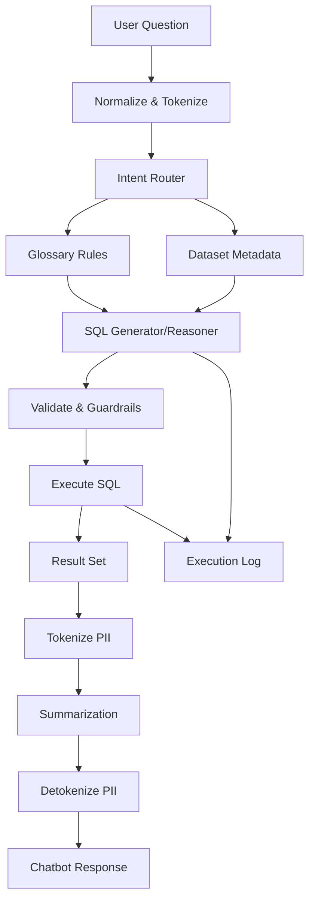
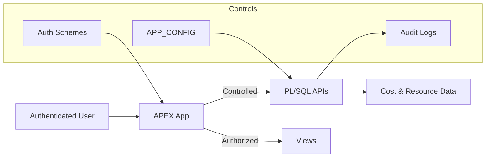

# NL2SQL Chatbot

Home: [README](../README.md) · **Docs** · **NL2SQL Chatbot**

## Purpose
The NL2SQL chatbot allows users to query OCI cost and resource data using **natural language**, without writing SQL.

Example questions:
- “Show total cost last month by service”
- “Which workloads increased cost this quarter?”
- “Cost per cluster including child resources”
- “Show monthly cost trend with MoM percentage change”

The chatbot is **metadata-driven**, explainable, and fully logged.

---

## Design Principles

- Deterministic SQL generation (not free-form LLM guessing)
- Business language mapped explicitly to schema
- No hardcoded table or column names
- Fully auditable execution
- Safe execution boundaries
- Declarative rule-based behavior via glossary metadata

---

## High-Level Flow

1. User submits a question via APEX  
2. Input is normalized and tokenized  
3. Intent and entities are inferred  
4. Glossary rules determine:
   - metrics
   - dimensions
   - filters
   - time ranges
   - comparison logic (MoM, WoW, trends)
5. SQL is generated  
6. SQL is validated and executed  
7. Results are summarized  
8. Full trace is logged  

---

## Chatbot Processing Pipeline



---

## Core Components

### 1. Glossary Rules (Primary Control Layer)

Glossary rules define how **business language maps to SQL semantics**.

They control:
- metrics
- filter dimensions
- grouping dimensions
- time logic
- period comparison semantics

Rules are stored in database tables and managed via APEX UI.

No application redeployment is required to extend vocabulary or behavior.

---

## Business Glossary Rules — Operator Guide


# Business Glossary Rules — Operator Guide (APEX UI Aligned)

This guide documents the **Business Glossary Rules module** exactly as exposed in the APEX UI.

Use this document to safely create, modify, and validate glossary rules that control NL2SQL behavior.

---

## Main UI Actions

### Refresh Rules
Reloads all glossary rules from the database.

---

### Create New Rule
Creates a new generic glossary rule (metrics, filters, time rules).

---

### Create Workload Rule
Creates workload-bound rules using existing WORKLOAD_NAME values.

Automatically generates keyword mappings.

---

## Business Glossary Grid Columns

These columns appear in the **Business Glossary Rules** report.

---

### Rule ID → System Identifier
Unique identifier of the rule group.

Example → 22

---

### Active → Enable / Disable Rule

Controls whether the rule is evaluated.

Values:
TRUE  
FALSE  

---

### Priority → Execution Order

Higher values execute first.

Recommended ranges:

Time rules → 150–300  
Workloads → 20–50  
Metrics → 1–10  

Example → 200

---

### Keyword → Trigger Token

Text matched from user input.

Example → cost  
Example → storage  
Example → MoM  

---

### Ord → Keyword Order

Order of evaluation inside the same Rule ID.

Use incremental values:

1, 2, 3, ...

---

### Match Mode → Matching Strategy

Controls keyword detection.

Values:

any → substring match  
exact → full token match  

Example → any

---

### Role → Rule Behavior Type

Defines SQL semantic behavior.

Supported values:

metric  
filter_dimension  
group_dimension  
generic_time_filter  

---

### Description → Operator Documentation

Human readable explanation of rule purpose.

Example → Numeric cost metric for OCI spend.

---

## Target Mapping Fields

Used for SQL binding.

---

### Target Table → SQL Source View

View used by the rule.

Examples:

COST_USAGE_MONTHLY_WKLD_V  
COST_USAGE_DAILY_WKLD_V  

---

### Target Column → SQL Column

Column affected by the rule.

Examples:

COST  
WORKLOAD_NAME  
SERVICECATEGORY  

---

### Target Role → SQL Semantic Role

Controls how SQL builder treats column.

Values:

metric  
filter_dimension  
group_dimension  

---

## Target Filter (JSON Editor)

Defines exact SQL predicate behavior.

Click **Format JSON** to validate syntax.

---

## Common Filter Templates

### Text Matching Filter

Field → Example

JSON Example:

```json
{
  "operator": "like",
  "value": "%{matched_keyword}%",
  "case": "upper"
}
```

Resulting SQL:

UPPER(column) LIKE '%STORAGE%'

---

### Exact Value Filter

Field → Example

JSON Example:

```json
{
  "operator": "=",
  "value": "123",
  "case": "none"
}
```

---

### Default Daily Snapshot Filter

Used on COST_USAGE_DAILY_WKLD_V

Field → Example

operator → =  
value → TRUNC(SYSDATE-3,'DD')  
case → none  

---

## Generic Filter Rule (Top JSON Section)

Used for time logic and global filters.

---

### Month Range Example (Summer)

Field → Example

JSON example:

```json
{
  "applies_to": "MONTH",
  "operator": "IN",
  "value": [
    "06",
    "07",
    "08",
    "6",
    "7",
    "8",
    "JUN",
    "JUL",
    "AUG",
    "JUNE",
    "JULY",
    "AUGUST"
  ],
  "case": "upper"
}
```

---

### Period Comparison Example (MoM)

Field → Example

JSON example: 

```json
{
  "applies_to": "PERIOD_COMPARISON",
  "comparison": {
    "type": "MOM",
    "basis": "PCT_CHANGE"
  },
  "time_grain": "MONTH",
  "requires_time_series": true,
  "include_outputs": [
    "CURRENT",
    "PREVIOUS",
    "DELTA",
    "PCT_CHANGE"
  ],
  "notes": "Compute base_value by month bucket then LAG(base_value) over bucket; pct_change=(base-prev)/NULLIF(prev,0)*100."
}
```

---

## Create Keyword Action

Available inside Update Rule dialog.

Allows adding multiple keywords to same Rule ID.

---

### Example

Rule ID → 41  
Keyword → spend  
Keyword → cost  

Both map to same metric behavior.

---

## Delete Keyword Button

Removes selected keyword mapping only.

Does NOT delete entire rule group.

---

## Delete Rule Button

Deletes full rule group including all keywords.

---

## Create Workload Rule Workflow

1. Click **Create Workload Rule**
2. Press **Create Key from Workloads**
3. Select workload values
4. Save

System auto-generates:

Keyword → workload name  
Target Column → WORKLOAD_NAME  
Filter Template → LIKE pattern  

---

## BusinessGlossaryTester

Use for validation.

Test:

Single keyword  
Combined phrases  
Time + metric + workload  

Verify:

Detected keywords  
Applied filters  
Generated SQL  

---

## Save Button Behavior

Validates:

JSON syntax  
Required fields  
Target bindings  

Only valid rules are stored.

---

## Cancel Button

Closes editor without saving.

---

## Best Practices

Always:

Use UPPER matching  
Prefer aggregated views  
Keep priorities separated  
Avoid overlapping keywords  
Test every rule  

---

## Production Safety Rules

Never:

Modify PROD without testing  
Use base tables  
Hardcode schema names  
Mix metric + filter roles  
Use ambiguous keywords  

---

## Recommended Rule Patterns

Metric rules → COST, USAGE  
Workload rules → WORKLOAD_NAME  
Service filters → SERVICECATEGORY  
Time rules → generic_time_filter  

---


---

## Rule Decision Matrix (What To Create)

Use this table to decide **which rule type to create** based on user intent.

| User Wants To Ask | Create Rule Role | Target Table | Target Column | JSON Needed |
|-------------------|----------------|-------------|---------------|-------------|
| "total cost", "spend" | metric | COST_USAGE_MONTHLY_WKLD_V | COST | No |
| "usage hours", "GB used" | metric | COST_USAGE_MONTHLY_WKLD_V | USAGE | No |
| "storage cost", "network cost" | filter_dimension | COST_USAGE_MONTHLY_WKLD_V | SERVICECATEGORY | LIKE filter |
| "by service", "per region" | group_dimension | COST_USAGE_MONTHLY_WKLD_V | SERVICECATEGORY / REGION | No |
| "Workload1 cost" | filter_dimension (Workload Rule) | COST_USAGE_DAILY_WKLD_V | WORKLOAD_NAME | Auto-generated |
| "today usage" | filter_dimension | COST_USAGE_DAILY_WKLD_V | DATE_BUCKET | Equals filter |
| "summer cost" | generic_time_filter | — | — | Month IN filter |
| "last 7 days" | generic_time_filter | — | — | Rolling window |
| "MoM trend" | generic_time_filter | — | — | PERIOD_COMPARISON |
| "monthly trend" | group_dimension | COST_USAGE_MONTHLY_WKLD_V | DATE_BUCKET | No |

---

## Quick Creation Recipes

### Recipe — Add New Cost Metric

Use when user asks about a numeric value.

Steps:

Create New Rule  
Role → metric  
Target Table → COST_USAGE_MONTHLY_WKLD_V  
Target Column → COST  
Priority → 5  
Keyword → spend  

---

### Recipe — Add Service Category Filter

Use when user mentions OCI services.

Steps:

Create New Rule  
Role → filter_dimension  
Target Column → SERVICECATEGORY  
Priority → 20  

Target Filter JSON:

{
  "operator": "like",
  "value": "%{matched_keyword}%",
  "case": "upper"
}

Keyword Examples:

storage  
network  
compute  

---

### Recipe — Add New Workload

Use when onboarding a new workload name.

Steps:

Click Create Workload Rule  
Press Create Key from Workloads  
Select workload  
Save  

System auto-generates filter rules.

---

### Recipe — Add Seasonal Time Logic

Use for business calendar concepts.

Steps:

Create New Rule  
Role → generic_time_filter  

Top JSON:

{
  "applies_to": "MONTH",
  "operator": "IN",
  "value": ["12","DEC","DECEMBER"],
  "case": "upper"
}

Keyword:

winter  
december  

---

### Recipe — Enable Period Comparison

Use for trends and deltas.

Steps:

Create New Rule  
Role → generic_time_filter  

Top JSON:

{
  "applies_to": "PERIOD_COMPARISON",
  "comparison": { "type": "MOM", "basis": "PCT_CHANGE" },
  "time_grain": "MONTH",
  "requires_time_series": true
}

Keyword:

MoM  
month over month  

---

## Admin Validation Checklist

Before deploying to PROD:

- Rule tested in BusinessGlossaryTester  
- SQL preview reviewed  
- Priority conflicts avoided  
- No duplicate keywords  
- Time logic validated  
- Dataset = LATEST  
- Environment = PROD  

---


---

### Rule Types (by ROLE)

#### metric
Defines measurable values.

Examples:
- cost → COST
- usage → USAGE

---

#### filter_dimension
Defines WHERE clause behavior.

Examples:
- “storage” → SERVICECATEGORY LIKE '%STORAGE%'
- Workload1 → WORKLOAD_NAME LIKE '%WORKLOAD1%'

---

#### group_dimension
Defines GROUP BY behavior.

Examples:
- “by service”
- “per workload”
- “per region”

---

#### generic_time_filter

Used for:

- Fixed ranges  
  - “summer”
  - “December”

- Rolling windows  
  - “last 7 days”
  - “past 3 months”

- Period comparisons  
  - MoM
  - WoW
  - DoD
  - QoQ

These rules may:

- inject WHERE clauses
- define time bucketing
- enforce time-series output
- trigger window functions

---

## Time Logic Examples

### Fixed period mapping (Summer)

```json
{
  "applies_to": "EXPR_FILTER",
  "expr": "EXTRACT(MONTH FROM DATE_BUCKET)",
  "operator": "IN",
  "value": [6,7,8]
}
```

---

### Default daily snapshot behavior

If user omits a date:

```sql
DATE_BUCKET = TRUNC(SYSDATE-3,'DD')
```

Ensures consistent reporting snapshots.

---

## Period Comparison Logic

Example glossary rule:

```json
{
  "applies_to": "PERIOD_COMPARISON",
  "comparison": { "type": "MOM", "basis": "PCT_CHANGE" },
  "time_grain": "MONTH",
  "requires_time_series": true
}
```

This automatically triggers:

- compare intent
- monthly bucketing
- LAG window functions
- percentage change calculation

---

## SQL Generation

SQL is generated from the reasoning plan.

Characteristics:

- No dynamic guessing
- No hidden joins
- No silent filters
- No unsafe clauses

---

## APEX Rule Management UI

Rules are maintained using APEX admin pages.

Screenshot placeholders:

Glossary Rule Editor  


Create Glossary Rule  


Update Glossary Rule  


Create Glossary Keyword   


Create Workload Rule  


Keyword Tester


Examples


---

## Guardrails



---

## Summarization

Results are rendered as:

- tables
- charts
- natural language explanations

Summaries describe:

- filters
- time window
- applied comparison logic
- metric interpretation

---

## Logging & Traceability

Every request logs:

- user input
- glossary hits
- reasoning JSON
- generated SQL
- execution statistics

---

## Extending the Chatbot

To add new logic:

1. Add glossary rule
2. Add keywords
3. Adjust priority
4. Test in UI

No PL/SQL changes required.

---

## Failure Modes

Typical causes:

- missing glossary coverage
- overlapping rules
- ambiguous time logic
- insufficient time range

All failures are logged.

---

See also:
- Usage Guide
- Admin Guide
- Security Model


---

## Recommended Authoring Guidelines

When creating glossary rules:

### Metrics
- Always map metrics to aggregated fact views
- Avoid raw base tables

### Filters
- Use `LIKE` with `UPPER()` for robustness
- Prefer semantic business terms over column names

### Time Rules
- Use `generic_time_filter` only for reusable patterns
- Use `PERIOD_COMPARISON` for trends and deltas

### Workloads
- Always use workload abstraction instead of hardcoded compartments

---

---
## Configuration Parameters (CHATBOT_PARAMETERS)

This section documents the parameters consumed by the NL2SQL engine (the attached PL/SQL packages) and the provided parameter export.

### Parameter reference

| Parameter | Type | Status | Used by (code) | What it does | One-sentence example |
|---|---|---|---|---|---|
| `CHART_SYSTEM` | CLOB prompt/component | Used | CHATBOT_CORE_CHART_PKG.txt (literal), CHATBOT_CORE_CHART_PKG.txt (load_component) | System prompt used by the chart suggestion phase to turn result rows into an ECharts-compatible chart specification JSON. | Update `CHART_SYSTEM` to adjust how the model behaves (e.g., enforce SQL-only output or change answer tone) without changing code. |
| `CONTEXT_TURNS` | Number | Used | CHATBOT_CORE_RUNNER_PKG.txt (literal) | Number of prior turns to include when building the conversation history block. | Set `CONTEXT_TURNS=4` to include the last 4 turns when constructing the relevant history context. |
| `DEBUG_FLAG` | Scalar (string/flag) | Used | CHATBOT_CORE_CTX_PARAMS_PKG.txt (literal) | Enables verbose logging (request/response payloads, intermediate CLOBs) when set to TRUE for the current dataset/environment. | Set `DEBUG_FLAG=TRUE` to enable the corresponding feature for a dataset/environment. |
| `FOLLOWUP_CONTEXT_TURNS` | Number | Referenced in code (missing from CSV) | CHATBOT_CORE_SQL_PKG.txt (get_num_param) | Number of previous turns included when building the follow-up decider history block. | Set `FOLLOWUP_CONTEXT_TURNS=4` to include the last 4 turns when constructing the relevant history context. |
| `FOLLOWUP_DECIDER_SYSTEM` | CLOB prompt/component | Used | CHATBOT_CORE_SQL_PKG.txt (literal), CHATBOT_CORE_SQL_PKG.txt (load_component), CHATBOT_FOLLOWUP_PKG.txt (literal), CHATBOT_FOLLOWUP_PKG.txt (load_component) | System prompt used to classify follow-up messages and decide whether to answer directly, ask a question, or rewrite SQL. | Update `FOLLOWUP_DECIDER_SYSTEM` to adjust how the model behaves (e.g., enforce SQL-only output or change answer tone) without changing code. |
| `FOLLOWUP_HISTORY_MAX_CHARS` | Number | Referenced in code (missing from CSV) | CHATBOT_CORE_SQL_PKG.txt (get_num_param) | Character budget for the follow-up decider history block. | Set `FOLLOWUP_HISTORY_MAX_CHARS=2000` to cap the associated prompt/input block at 2,000 characters. |
| `FOLLOWUP_SQL_SYSTEM` | CLOB prompt/component | Used | CHATBOT_CORE_RUNNER_PKG.txt (literal) | Prompt template used to generate a revised SQL statement from previous SQL plus a follow-up request. | Update `FOLLOWUP_SQL_SYSTEM` to adjust how the model behaves (e.g., enforce SQL-only output or change answer tone) without changing code. |
| `GENERAL_CHAT_SYSTEM` | CLOB prompt/component | Used | CHATBOT_CORE_RUNNER_PKG.txt (literal) | System prompt used when the resolved intent is GENERAL_CHAT (no SQL execution). | Update `GENERAL_CHAT_SYSTEM` to adjust how the model behaves (e.g., enforce SQL-only output or change answer tone) without changing code. |
| `GLOSSARY_EXTRACT_SYSTEM` | CLOB prompt/component | Used | CHATBOT_CORE_RUNNER_PKG.txt (literal) | System prompt used to extract the most relevant glossary rules/keywords for the current question. | Update `GLOSSARY_EXTRACT_SYSTEM` to adjust how the model behaves (e.g., enforce SQL-only output or change answer tone) without changing code. |
| `GLOSSARY_TEXT` | CLOB prompt/component | Used | CHATBOT_CORE_SQL_PKG.txt (literal) | Export of glossary rules/keywords in compact text form used to ground the NL2SQL generation. | Update `GLOSSARY_TEXT` to add new business terms (e.g., map “credit burn” to the CREDIT_CONSUMPTION_STATE view) and the bot will pick them up. |
| `GLOSSARY_THRESHOLD_SCORE10` | Number | Used | CHATBOT_CORE_RUNNER_PKG.txt (literal) | Numeric threshold controlling when the 'glossary quick match' gate is considered confident enough to reuse/return its excerpt. | Set `GLOSSARY_THRESHOLD_SCORE10=7.0` so only intent scores ≥7/10 are treated as NL2SQL. |
| `HISTORY_MAX_CHARS` | Number | Used | CHATBOT_CORE_RUNNER_PKG.txt (literal) | Character budget for the history block included in prompts. | Set `HISTORY_MAX_CHARS=2000` to cap the associated prompt/input block at 2,000 characters. |
| `INTENT_NL2SQL_THRESHOLD_SCORE10` | Number | Used | CHATBOT_CORE_SQL_PKG.txt (literal) | Threshold (0–10 scale) above which the ensemble intent resolver treats a message as NL2SQL (otherwise GENERAL_CHAT / CLARIFY). | Set `INTENT_NL2SQL_THRESHOLD_SCORE10=7.0` so only intent scores ≥7/10 are treated as NL2SQL. |
| `INTENT_SYSTEM` | CLOB prompt/component | Used | CHATBOT_CORE_SQL_PKG.txt (literal), CHATBOT_CORE_SQL_PKG.txt (load_component) | System prompt used by the intent classifier LLM (returns NL2SQL vs GENERAL_CHAT vs FOLLOWUP_CLARIFY, etc.). | Update `INTENT_SYSTEM` to adjust how the model behaves (e.g., enforce SQL-only output or change answer tone) without changing code. |
| `MAX_EXAMPLES_CHARS` | Number | Unknown | — | Maximum characters allowed for any example/few-shot block after clamping. | Set `MAX_EXAMPLES_CHARS=2000` to cap the associated prompt/input block at 2,000 characters. |
| `MAX_FULL_JSON_CHARS` | Number | Unknown | — | Maximum characters allowed when returning full result JSON (safety cap). | Set `MAX_FULL_JSON_CHARS=2000` to cap the associated prompt/input block at 2,000 characters. |
| `MAX_HISTORY_CHARS` | Number | Unknown | — | Maximum characters allowed for history included in prompts after clamping. | Set `MAX_HISTORY_CHARS=2000` to cap the associated prompt/input block at 2,000 characters. |
| `MAX_INSTRUCTION_CHARS` | Number | Unknown | — | Maximum characters allowed for the NL2SQL instruction block after clamping. | Set `MAX_INSTRUCTION_CHARS=2000` to cap the associated prompt/input block at 2,000 characters. |
| `MAX_REPHRASE_CHARS` | Number | Unknown | — | Maximum characters allowed for the rephrased question (or rephrase prompt inputs) after clamping. | Set `MAX_REPHRASE_CHARS=2000` to cap the associated prompt/input block at 2,000 characters. |
| `MAX_SCHEMA_CHARS` | Number | Referenced in code (missing from CSV) | CHATBOT_CORE_SQL_PKG.txt (get_num_param) | Maximum characters allowed for the schema block (SCHEMA slice or full) after clamping. | Set `MAX_SCHEMA_CHARS=2000` to cap the associated prompt/input block at 2,000 characters. |
| `MAX_TABLEDESC_CHARS` | Number | Referenced in code (missing from CSV) | CHATBOT_CORE_SQL_PKG.txt (get_num_param) | Maximum characters allowed for the table descriptions block after clamping. | Set `MAX_TABLEDESC_CHARS=2000` to cap the associated prompt/input block at 2,000 characters. |
| `NL2SQL_INSTRUCTION` | CLOB prompt/component | Used | CHATBOT_CORE_RUNNER_PKG.txt (literal) | Primary instruction/prompt template for the NL2SQL generation phase (may fall back to INSTRUCTION). | Update `NL2SQL_INSTRUCTION` to adjust how the model behaves (e.g., enforce SQL-only output or change answer tone) without changing code. |
| `REASONING_ENABLED` | Scalar (string/flag) | Used | CHATBOT_CORE_RUNNER_PKG.txt (literal) | Flag (TRUE/FALSE) controlling whether the REASONING phase runs. | Set `REASONING_ENABLED=TRUE` to enable the corresponding feature for a dataset/environment. |
| `REASONING_SYSTEM` | CLOB prompt/component | Used | CHATBOT_CORE_RUNNER_PKG.txt (literal) | System prompt for the optional REASONING phase that produces a structured plan JSON before SQL generation. | Update `REASONING_SYSTEM` to adjust how the model behaves (e.g., enforce SQL-only output or change answer tone) without changing code. |
| `REDACTION_ENABLED` | Scalar (string/flag) | Referenced in code (missing from CSV) | CHATBOT_CORE_CHART_PKG.txt (get_param_value), CHATBOT_CORE_SUMMARY_PKG.txt (get_param_value) | Flag controlling whether preview/result JSON is tokenized/redacted before being sent to chart/summary LLMs. | Set `REDACTION_ENABLED=TRUE` to enable the corresponding feature for a dataset/environment. |
| `ROUTER_ENABLED` | Scalar (string/flag) | Used | CHATBOT_CORE_CTX_PARAMS_PKG.txt (get_param_value), CHATBOT_CORE_CTX_PARAMS_PKG.txt (literal) | Flag controlling whether table routing is enabled (routes to a subset of SCHEMA/TABLE_DESCRIPTIONS before NL2SQL). | Set `ROUTER_ENABLED=TRUE` to enable the corresponding feature for a dataset/environment. |
| `ROUTER_SYSTEM` | CLOB (system prompt) | Used | `CHATBOT_ROUTER_PKG.route_tables` | System prompt for the **table router** LLM call; if NULL, a built-in fallback prompt is used.  | Set `ROUTER_SYSTEM` to: “Choose the minimal set of tables and joins; output strict JSON only.” |
| `SCHEMA` | CLOB prompt/component | Used | CHATBOT_CORE_RUNNER_PKG.txt (literal), CHATBOT_CORE_SQL_PKG.txt (literal), CHATBOT_CORE_SQL_PKG.txt (load_component) | Authored schema JSON blocks ("tables":[...]) loaded into prompts; can have multiple rows and is concatenated/deduped upstream. | Provide a JSON document in `SCHEMA` (e.g., a `{"tables":[...]}` structure) so the model can ground joins and columns. |
| `STRICT_SQL_OUTPUT` | CLOB prompt/component | Used | CHATBOT_CORE_RUNNER_PKG.txt (literal) | Additional guardrail prompt forcing the model to output only executable SQL (no markdown/plans/explanations). | Update `STRICT_SQL_OUTPUT` to adjust how the model behaves (e.g., enforce SQL-only output or change answer tone) without changing code. |
| `SUMMARY_SYSTEM` | CLOB prompt/component | Used | CHATBOT_CORE_RUNNER_PKG.txt (literal), CHATBOT_CORE_SUMMARY_PKG.txt (literal), CHATBOT_CORE_SUMMARY_PKG.txt (load_component) | System prompt used to summarize query results (rows/plan/meta) into the final user-facing answer. | Update `SUMMARY_SYSTEM` to adjust how the model behaves (e.g., enforce SQL-only output or change answer tone) without changing code. |
| `TABLE_DESCRIPTIONS` | CLOB prompt/component | Used | CHATBOT_CORE_RUNNER_PKG.txt (literal), CHATBOT_CORE_SQL_PKG.txt (literal), CHATBOT_CORE_SQL_PKG.txt (load_component), CHATBOT_CORE_SUMMARY_PKG.txt (literal) | Authored table description JSON blocks ("tables":[...]) loaded into prompts; can have multiple rows and is concatenated/deduped upstream. | Provide a JSON document in `TABLE_DESCRIPTIONS` (e.g., a `{"tables":[...]}` structure) so the model can ground joins and columns. |
| `TABLE_JOINS` | CLOB prompt/component | Used | CHATBOT_CORE_RUNNER_PKG.txt (literal) | Join metadata JSON describing how tables relate (used by reasoning/router/NL2SQL to avoid invented joins). | Provide a JSON document in `TABLE_JOINS` (e.g., a `{"tables":[...]}` structure) so the model can ground joins and columns. |
