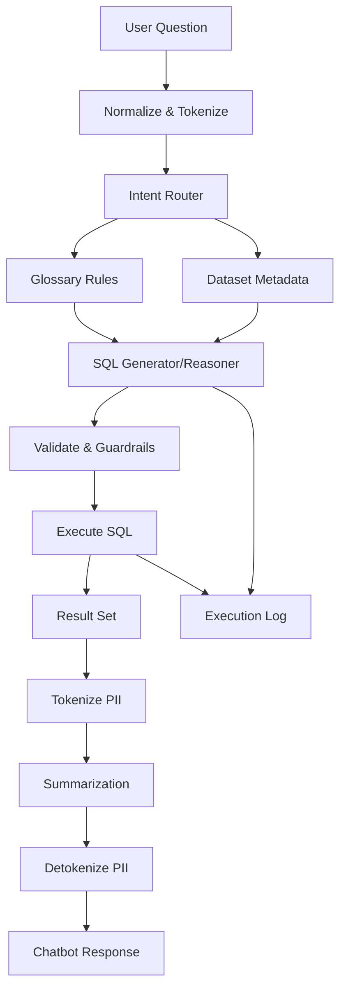
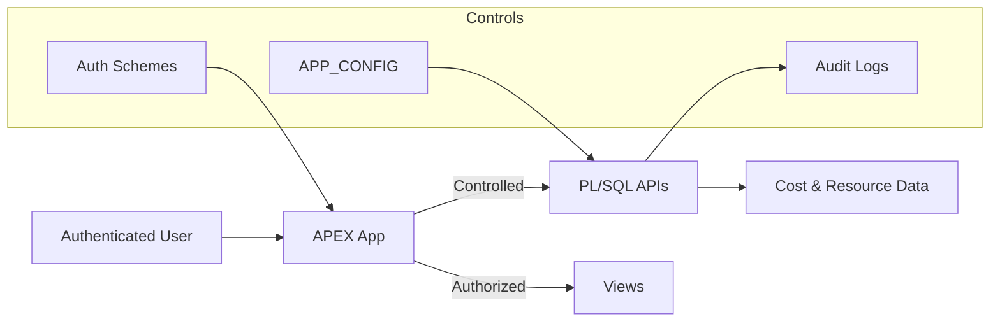

# NL2SQL Chatbot

Home: [README](../README.md) · **Docs** · **NL2SQL Chatbot**

The NL2SQL chatbot lets users query OCI cost and resource data using natural language.
It is designed to be **explainable**, **metadata-driven**, and **auditable**.

Example questions:
- “Show total cost last month by service”
- “Which workloads increased cost this quarter?”
- “Cost per cluster including child resources”
- “Show monthly cost trend with MoM percentage change”

---

## Design goals
- Prefer deterministic, schema-aware SQL generation over “guessing”
- Map business language to datasets via explicit metadata (glossary rules)
- Keep execution safe with validation and limits
- Log enough detail to answer “why did it do that?” during review

---

## Processing pipeline



---

## Core control surfaces

### 1) Glossary rules (primary behavior layer)
Glossary rules map business language to SQL semantics (metrics, dimensions, filters, time logic, comparisons).
They are intentionally declarative so operators can adjust behavior without changing code.

Rule types (high level):
- **Metric mapping**: what “cost”, “usage”, “credits”, etc. mean in the schema
- **Dimension mapping**: service, workload, compartment, resource, tag keys
- **Filter templates**: how to build safe predicates
- **Time logic**: interpreting “last month”, “summer”, “this quarter”, etc.
- **Comparisons**: MoM/WoW changes, trend detection, percent change outputs

### 2) Dataset metadata (guardrails + routing)
Dataset metadata helps the system:
- choose which tables/views are valid candidates
- understand keys/metrics/dimensions
- generate correct joins and groupings

---

## Time logic examples
“Summer” as an example of explicit business-time mapping:

```json
{
  "applies_to": "EXPR_FILTER",
  "expr": "EXTRACT(MONTH FROM DATE_BUCKET)",
  "operator": "IN",
  "value": [6,7,8]
}
```

Default daily snapshot behavior (used by some “as of” dashboards):

```sql
DATE_BUCKET = TRUNC(SYSDATE-3,'DD')
```

---

## Period comparison logic
Example comparison rule (MoM percent change on monthly grain):

```json
{
  "applies_to": "PERIOD_COMPARISON",
  "comparison": { "type": "MOM", "basis": "PCT_CHANGE" },
  "time_grain": "MONTH",
  "requires_time_series": true
}
```

---

## Guardrails and trust boundaries
The chatbot is not a raw “SQL generator”. It operates inside constraints:
- validated dataset allowlists
- enforced row/timeout limits
- controlled filter templates (to avoid unsafe predicates)
- deterministic SQL assembly from structured reasoning output

Conceptual boundary:



---

## Practical glossary examples

### Example — Service category filter template
Rule template:

```json
{
  "operator": "like",
  "case": "upper",
  "value": "%{matched_keyword}%"
}
```

Resulting SQL pattern:

```sql
UPPER(SERVICECATEGORY) LIKE '%NETWORK%'
```

### Example — Workload mapping
Example SQL predicate pattern:

```sql
UPPER(WORKLOAD_NAME) LIKE '%WORKLOAD1%'
```

### Example — Time filter keyword list (MONTH)
Rule example:

```json
{
  "applies_to": "MONTH",
  "operator": "IN",
  "value": ["06","07","08","JUN","JUL","AUG","JUNE","JULY","AUGUST"],
  "case": "upper"
}
```

Resulting SQL pattern:

```sql
TO_CHAR(DATE_BUCKET,'MM') IN ('06','07','08')
```

### Example — Period comparison (MoM)
Rule example:

```json
{
  "applies_to": "PERIOD_COMPARISON",
  "comparison": "MOM",
  "grain": "MONTH",
  "requires_time_series": true,
  "default_output": "PCT_CHANGE"
}
```

---

## APEX rule management UI
Glossary rules are managed in the admin UI (create/edit/test). The UI is designed so non-developers can:
- add synonyms and mappings safely
- test whether keywords match as expected
- keep rule changes traceable

See [APEX Pages Map](apex-pages.md) to locate the rule pages in your deployment.

---

## Logging and traceability
Every request should be traceable end-to-end:
- the user question (normalized)
- selected candidate datasets
- applied glossary rules
- structured reasoning output
- final SQL and bind values
- execution metadata and errors
- summarization output (if enabled)

When troubleshooting, always capture the relevant log entry id/run id.

---

## Failure modes (most common)
- Missing glossary coverage (keyword not mapped → poor routing)
- GenAI access not enabled (IAM/policy/region availability)
- Guardrails blocked execution (expected for unsafe/broad queries)
- Data not loaded (chatbot can only query what exists)

If you see repeated failures, start with:
- [Infrastructure Requirements](infra-requirements.md) (GenAI policy)
- [Configuration](configuration.md) (chatbot enablement and limits)
- [Troubleshooting](troubleshooting.md)

---

## Recommended authoring guidelines
- Keep rules narrow and explicit; avoid “catch-all” keywords.
- Prefer reusable filter templates and standard operators.
- Make time rules deterministic (explicit month lists, known offsets) rather than ambiguous language.
- Treat rule changes like production changes: test, log, and review.

---

### Daily snapshot reminder
Some default logic uses a “SYSDATE - 3” snapshot day (to avoid partial-day reporting). Example:

```sql
DATE_BUCKET = TRUNC(SYSDATE - 3,'DD')
```
