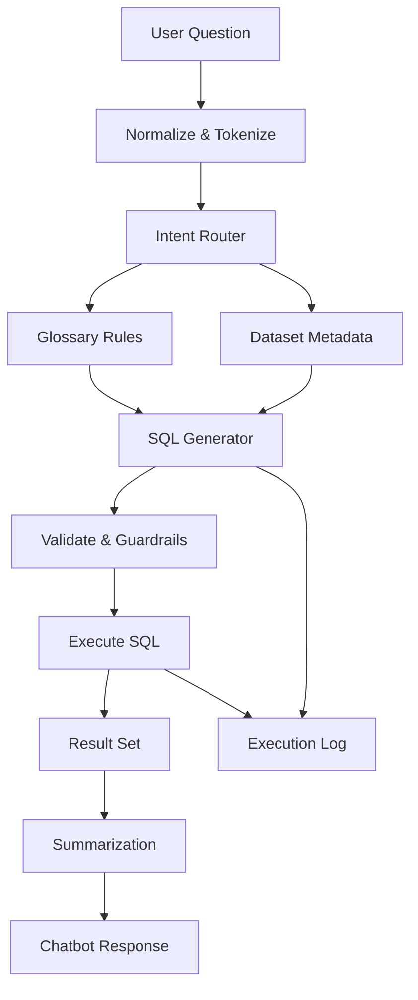
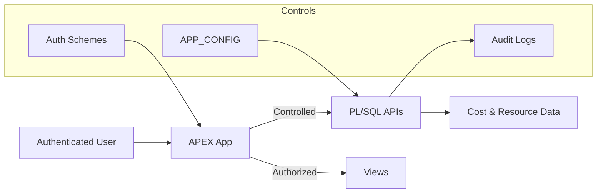

# NL2SQL Chatbot

## Purpose
The NL2SQL chatbot allows users to query OCI cost and resource data using **natural language**, without writing SQL.

Example questions:
- “Show total cost last month by service”
- “Which workloads increased cost this quarter?”
- “Cost per cluster including child resources”

The chatbot is **metadata-driven**, explainable, and fully logged.

---

## Design Principles

- Deterministic SQL generation (not free-form LLM guessing)
- Business language mapped explicitly to schema
- No hardcoded table or column names
- Fully auditable execution
- Safe execution boundaries

---

## High-Level Flow

1. User submits a question via APEX
2. Input is normalized and tokenized
3. Intent and entities are inferred
4. Glossary rules determine:
   - metrics
   - dimensions
   - filters
   - time ranges
5. SQL is generated
6. SQL is validated and executed
7. Results are summarized
8. Full trace is logged

---

## Chatbot Processing Pipeline

The following diagram shows the deterministic NL2SQL pipeline used by the chatbot.

This makes the chatbot:
- explainable
- auditable
- safe by design

---

## Core Components

### 1. Glossary Rules
Glossary rules define how **business language** maps to the data model.

Each rule describes:
- what a keyword represents (metric, filter, group)
- which table/column it maps to
- how it can be used (select, where, group by)

Rules are stored in tables and can be edited without code changes.

---

### 2. Keywords & Synonyms
Keywords link user language to glossary rules.

Examples:
- “cost”, “spend”, “expense”
- “last month”, “previous month”
- “service”, “product”, “resource”

Multiple keywords can map to the same rule.

---

### 3. Intent Routing
The router determines:
- which dataset is relevant
- whether the query is analytical, descriptive, or summary
- which SQL template to use

Routing is rule-based and deterministic.

---

### 4. SQL Generation
Based on inferred intent:
- select list is assembled
- filters are applied
- grouping is determined
- time logic is injected

Generated SQL:
- targets known fact tables
- applies normalization where required
- avoids unsafe constructs

---

### 5. Execution
Before execution:
- SQL is validated
- row limits are enforced
- execution context is logged

Execution is performed entirely in the database.

---

## Chatbot Guardrails

The pipeline enforces strict validation and logging before execution.

---

### 6. Summarization
Results are summarized into:
- human-readable text
- tabular output
- charts (via APEX)

Summaries explain:
- what was queried
- what filters were applied
- what the result represents

---

## Logging & Traceability

Every chatbot request records:
- request id
- raw user input
- inferred intent
- applied rules
- generated SQL
- execution status
- result metadata

This enables:
- debugging
- auditing
- iterative improvement

---

## Extending the Chatbot

To add new concepts:
1. Add glossary rule
2. Add keywords/synonyms
3. (Optional) add dataset support
4. Test via chatbot UI

No PL/SQL changes are required for most extensions.

---

## Failure Modes

Common issues:
- missing glossary coverage
- ambiguous keywords
- misconfigured time logic
- missing data for selected period

All failures are logged with actionable detail.

