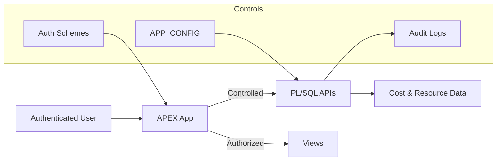

# Security & Trust Model

This document explains how the application protects data, enforces access, and ensures trustworthy results.

It is written for:
- end users who need confidence
- administrators responsible for access
- auditors and security reviewers
- architects evaluating risk

---

## Security Philosophy

The application follows these core principles:

- **Least privilege** at every layer
- **No secrets in source control**
- **Database-enforced access**
- **Full auditability**
- **Explainable analytics and AI**

Security is not an afterthought; it is part of the architecture.

---

## Security Boundaries

The diagram below illustrates where access control and auditability are enforced.

All access is mediated through database logic and logged.

---

## Authentication

### How users authenticate
Authentication is handled by **Oracle APEX**, using one of:
- OCI IAM / federated identity
- enterprise SSO
- database-backed authentication (if configured)

The application does **not** implement custom authentication logic.

---

## Authorization & Roles

### Authorization Model
Access is enforced using:
- APEX authorization schemes
- application roles
- page- and component-level checks

### Role Separation
Typical roles include:
- **End users** (dashboards, reports, chatbot)
- **Power users** (advanced filters, saved reports)
- **Administrators** (configuration, jobs, glossary)

Administrative pages are not visible or accessible to standard users.

---

## Data Access Boundaries

### Database-Centric Enforcement
All data access:
- occurs in the database
- is mediated by views and PL/SQL packages
- respects configuration and filters

APEX pages do not bypass database logic.

---

### Compartment & Scope Control
OCI data visibility is controlled via:
- configured root compartments
- allowed region lists
- workload definitions

This ensures users only see **intended data scopes**.

---

## Secrets Management

### What is *not* stored in GitHub
- OCI credentials
- OAuth client secrets
- private keys
- wallet contents
- tokens

### How secrets are handled
- injected via database credentials
- managed externally (OCI, ADB, or infrastructure tooling)
- referenced by name only in code/config

GitHub contains **no sensitive material**.

---

## Chatbot Security (NL2SQL)

### Deterministic SQL Generation
The chatbot:
- does not execute free-form SQL
- generates SQL only from predefined metadata
- restricts tables, columns, and clauses

This prevents:
- SQL injection
- data exfiltration
- schema exploration

---

### Execution Guardrails
Before execution:
- SQL is validated
- row limits are enforced
- time ranges are bounded

Queries cannot escape the intended analytical scope.

---

### Transparency & Explainability
For every chatbot request:
- generated SQL is logged
- applied filters are recorded
- execution context is traceable

Users and auditors can see **exactly what was executed**.

---

## Logging & Auditability

### What is logged
- user actions (where relevant)
- job executions
- chatbot requests
- SQL generation
- errors and warnings

### Why this matters
- incident investigation
- cost attribution audits
- compliance reviews
- chatbot governance

Logs are queryable and correlated via IDs.

---

## Data Integrity & Trust

### Source of Truth
All analytics derive from:
- OCI Cost & Usage data
- OCI resource metadata

No manual overrides of cost values exist in the application.

---

### Configuration Transparency
All behavior is driven by:
- visible configuration tables
- documented keys
- auditable changes

This avoids “hidden logic”.

---

## Environment Isolation

Each environment (DEV / TEST / PROD):
- has its own database schema
- has its own APP_CONFIG values
- has isolated credentials and jobs

Cross-environment data leakage is not possible by design.

---

## Common Security Questions

### “Can users see raw OCI credentials?”
No. Credentials are never exposed via UI or GitHub.

---

### “Can the chatbot access data it shouldn’t?”
No. It can only generate SQL against predefined metadata.

---

### “Can admins change cost numbers?”
No. Admins can change configuration and metadata, not source cost data.

---

### “Is this explainable to auditors?”
Yes. Every result can be traced back to:
- source data
- configuration
- generated SQL
- execution logs

---

## Security Best Practices

- Restrict admin access tightly
- Review configuration changes
- Monitor chatbot logs
- Rotate credentials externally
- Treat config as code

---

## Final Note

Security here is **practical, transparent, and auditable**.

Users can trust the numbers.  
Admins can control scope.  
Auditors can verify behavior.

This is by design.
